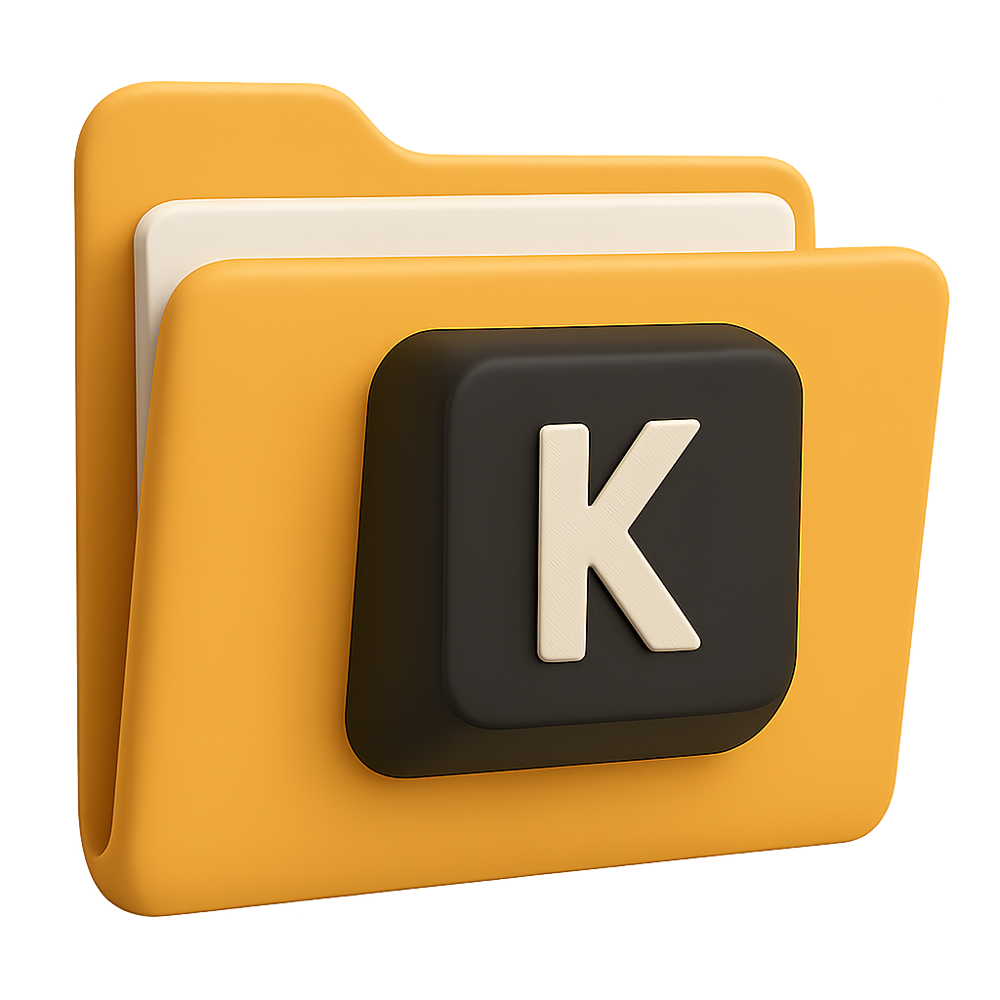
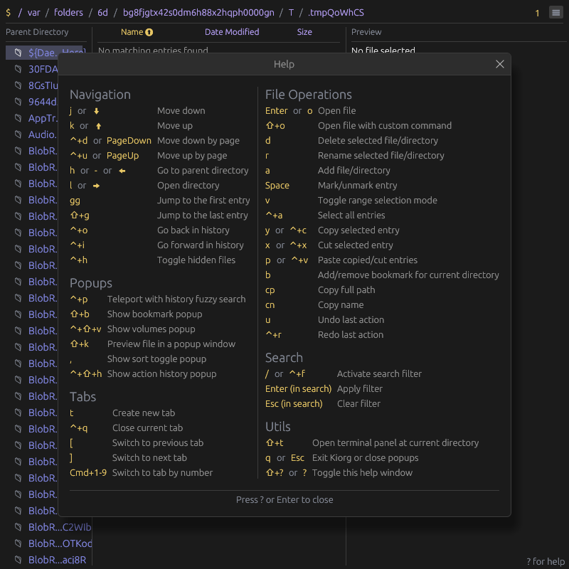
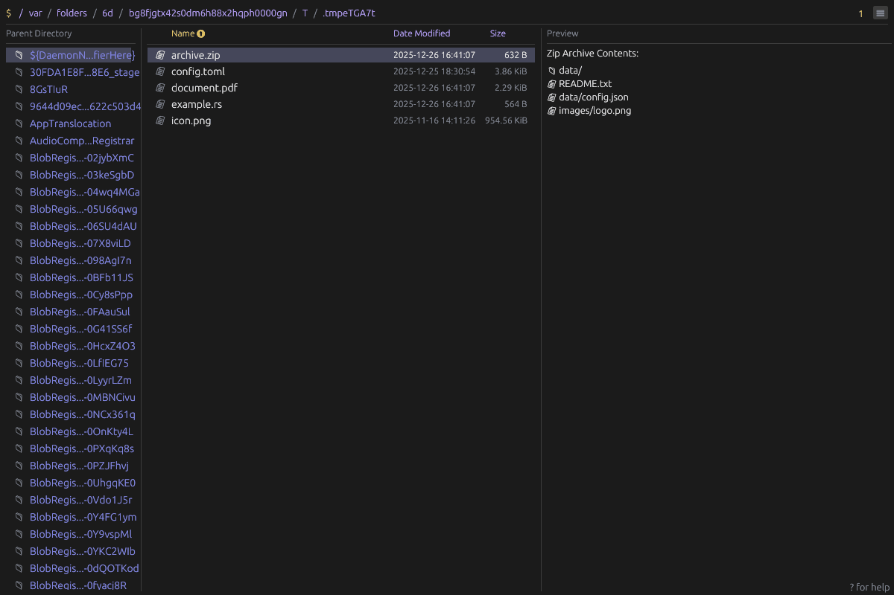
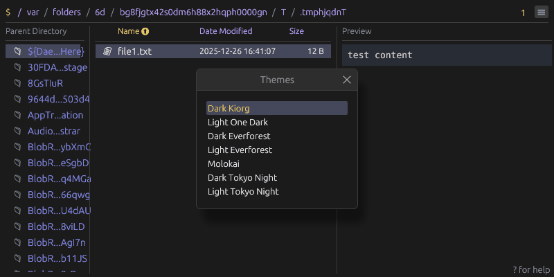

# Kiorg
[](https://github.com/houqp/kiorg/releases)
[](https://discord.gg/TdTb2CHfpr)

<p align="center">
  
</p>

Kiorg is a performance focused cross-platform file manager with Vim-inspired key
bindings. It is built using the [egui](https://www.egui.rs/#demo) framework.

## Key Features

* Lightingly fast rendering and navigation
* Multi-tab support
* Vim-inspired keyboard shortcuts
* Built-in zoxide like fuzzy directory teleport
* Content preview for various file formats including code syntax highlight, image, video,pdf, epub, etc.
* Customizable shortcuts and color themes through TOML config files
* Cross-platform support (Linux, macOS, Windows)
* Bookmarks for quick access to frequently used directories
* Single self-contained binary with battery included
* Builtin terminal emulator
* App state persistence
* Language agnostic plugin system
* Undo/redo file operations

## Screenshots

<p align="center">
  
  <br>
  <em>Built-in help menu with keyboard shortcuts</em>
</p>

<p align="center">
  
  <br>
  <em>File content preview</em>
</p>

<p align="center">
  
  <br>
  <em>Customizable color themes</em>
</p>

## Installation

Pre-built binaries for all platforms are available on the [releases page](https://github.com/houqp/kiorg/releases).

Alternatively, you can build and install from source using cargo:

```bash
cargo install --locked --git  https://github.com/houqp/kiorg.git kiorg
```

## Configuration

Kiorg reads the `config.toml` TOML configuration file stored in the following locations:

* Linux: `~/.config/kiorg/`
* macOS: `~/.config/kiorg/` (if it exists) or `~/Library/Application Support/kiorg/`
* Windows: `%APPDATA%\kiorg\`

### Sample Configuration

```toml
# Sort preference configuration (optional)
[sort_preference]
column = "Name"             # Sort column: "Name", "Modified", "Size", or "None"
order = "Ascending"         # Sort order: "Ascending" or "Descending"

[layout]
preview = 0.5 # Increase preview default width ratio to 50%

# Override default shortcuts (optional)
[shortcuts]
MoveDown = [
  { key = "j" },
  { key = "down" }
]
MoveUp = [
  { key = "k" },
  { key = "up" }
]
DeleteEntry = [
  { key = "d" }
]
ActivateSearch = [
  { key = "/" },
  { key = "f", ctrl = true }
]
```

### Custom Theme

To define a custom theme:

```toml
# Select your custom theme
theme = "my_cool_theme"

# Define the custom theme colors
[[custom_themes]]
name = "my_cool_theme"
display_name = "My Cool Theme"
[custom_themes.colors]
fg = "#FAF7F0"                  # Main text color
bg = "#000000"                  # Main background color
bg_light = "#080808"            # Lighter background (panels, separators)
bg_extreme = "#050505"          # Darkest background (scrollbars, inputs)
bg_selected = "#1A1A1A"         # Selected item background
bg_fill = "#1A1A1A"             # UI element background
bg_interactive_fill = "#262626" # Interactive element background
bg_active = "#333333"           # Active element background
fg_selected = "#FAF7F0"         # Selected text color
fg_light = "#4E5A6A"            # Dimmed/secondary text
fg_folder = "#87CEEB"           # Folder icon color
highlight = "#FFA247"           # Highlight color
link_text = "#7FA5CC"           # Link text color
link_underscore = "#58B8FD"     # Link underline color
warn = "#FFA247"                # Warning color
error = "#D06666"               # Error color
success = "#6BBF59"             # Success color
```

You can try asking LLM to generate these custom theme configs for you based on themes from other apps, it typically works one shot.


## Development

### Common workflows

* To run static analysis: `cargo clippy --workspace --all-targets -- -D warnings`
* To execute tests, run: `cargo test` or `cargo nextest run`
  * Recommend nextest since it's 2-3x faster.
* To regenerate screenshots in readme: `UPDATE_SNAPSHOTS=1 cargo test --features=snapshot`

### Design patterns

* Composition over inheritance.
* Simple modular design and avoid unnecessary abstractions.
* Leverage async operations for long-running tasks to prevent blockign UI rendering.
* Implementing user preference persistence for improved user experience.
* Clean layout with compact spacing and alignment, functionality over flashy visuals.
