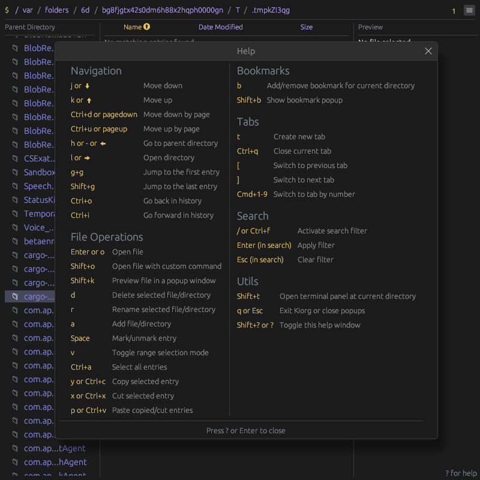

# Kiorg
[](https://github.com/houqp/kiorg/releases)
[](https://discord.gg/TdTb2CHfpr)

<p align="center">
  
</p>

Kiorg is a performance focused cross-platform file manager with Vim-inspired key
bindings. It is built using the [egui](https://www.egui.rs/#demo) framework.

## Key Features

* Lightingly fast rendering and navigation
* Multi-tab support
* Vim-inspired keyboard shortcuts
* Built-in zoxide like fuzzy directory teleport
* Content preview for various file formats including code syntax highlight, image, pdf, epub, etc.
* Customizable shortcuts and color themes through TOML config files
* Cross-platform support (Linux, macOS, Windows)
* Bookmarks for quick access to frequently used directories
* Single self-contained binary with battery included
* Builtin terminal emulator
* App state persistence

## Screenshots

<p align="center">
  
  <br>
  <em>Built-in help menu with keyboard shortcuts</em>
</p>

<p align="center">
  
  <br>
  <em>Customizable color themes</em>
</p>

## Installation

Pre-built binaries for all platforms are available on the [releases page](https://github.com/houqp/kiorg/releases).

Alternatively, you can build it from source using cargo:

```bash
git clone --recurse-submodules https://github.com/houqp/kiorg.git && cargo install --locked --path ./kiorg
```

## Configuration

Kiorg uses TOML configuration files stored in the user's config directory:

* Linux: `~/.config/kiorg/`
* macOS: `~/.config/kiorg/` (if it exists) or `~/Library/Application Support/kiorg/`
* Windows: `%APPDATA%\kiorg\`

### Sample Configuration

```toml
# Sort preference configuration (optional)
[sort_preference]
column = "Name"             # Sort column: "Name", "Modified", "Size", or "None"
order = "Ascending"         # Sort order: "Ascending" or "Descending"

[layout]
preview = 0.5 # Increase preview default width ratio to 50%

# Override default shortcuts (optional)
[shortcuts]
MoveDown = [
  { key = "j" },
  { key = "down" }
]
MoveUp = [
  { key = "k" },
  { key = "up" }
]
DeleteEntry = [
  { key = "d" }
]
ActivateSearch = [
  { key = "/" },
  { key = "f", ctrl = true }
]
```